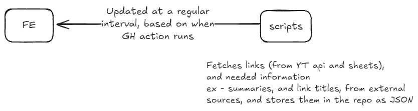
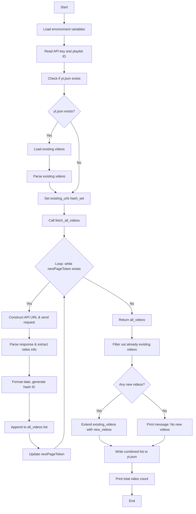
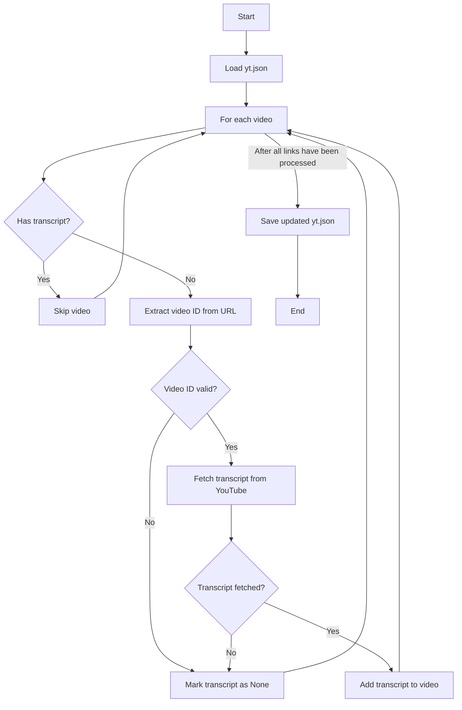
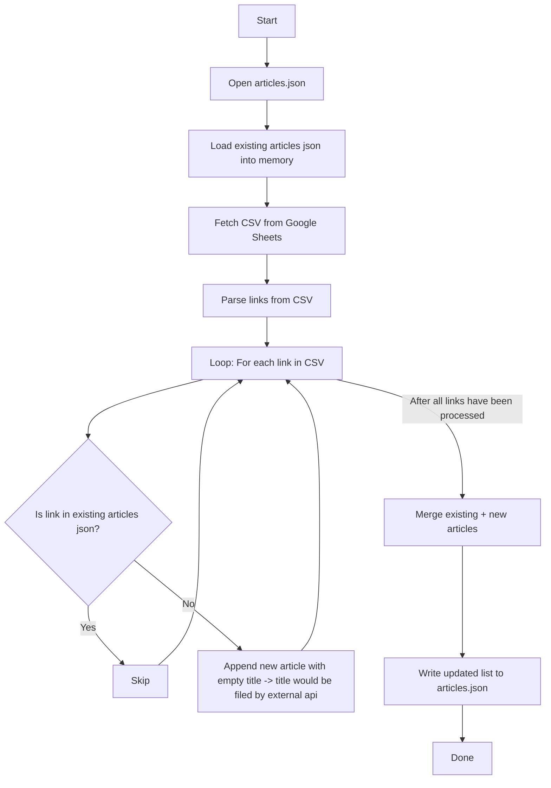
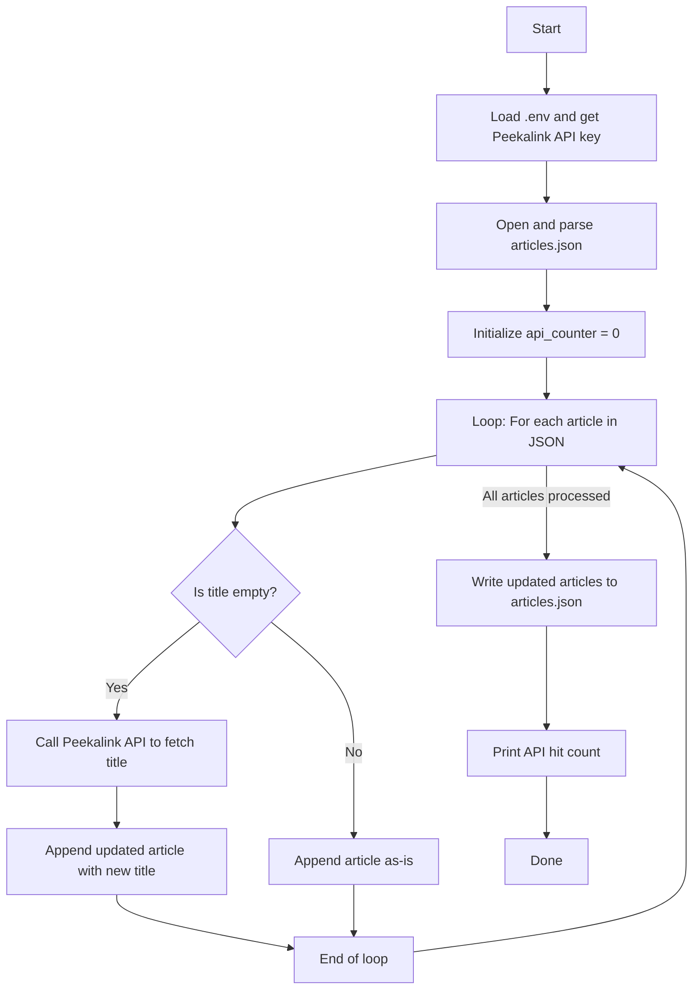
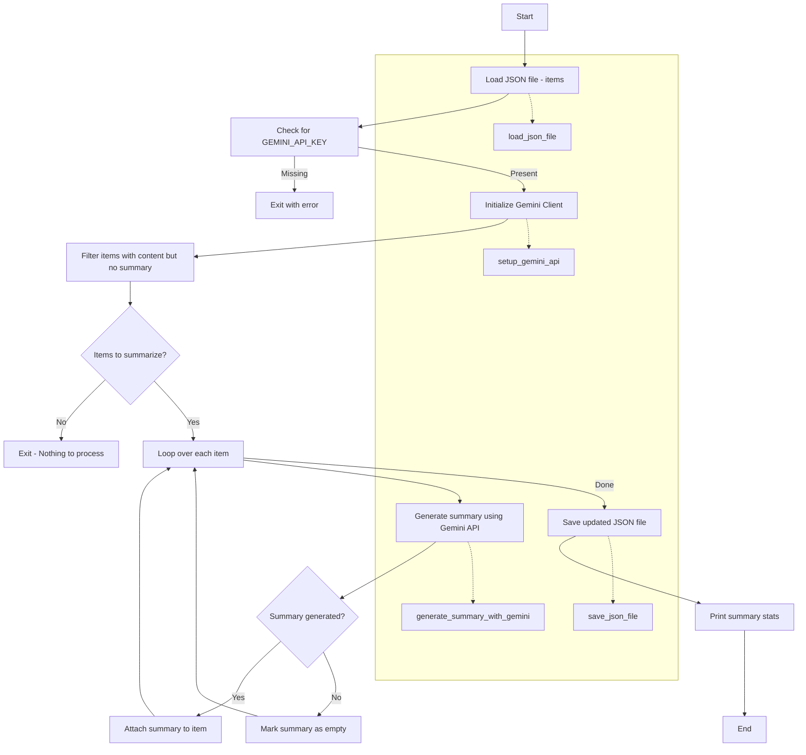
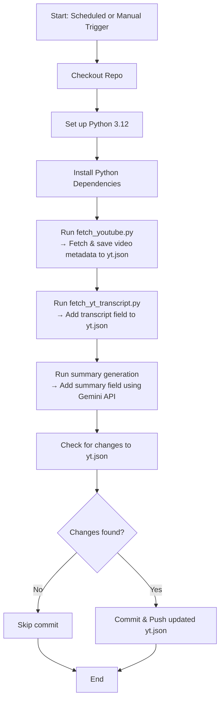
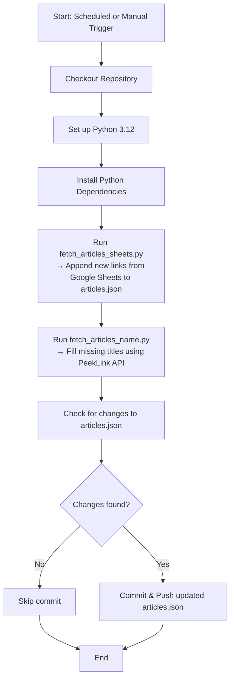
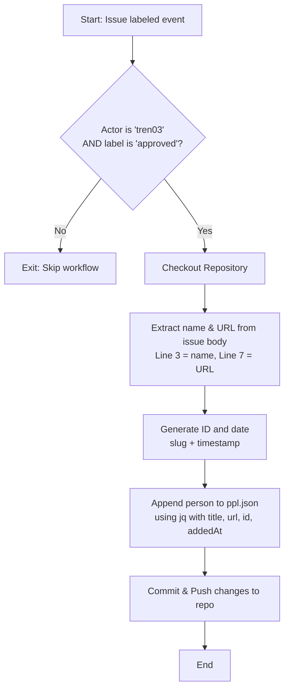

# Overview

This document contains information regarding how Techdex processes and fetches links, and an overview of the Frontend

# Motivation 

It helps me store links about software that I can share online. It can also act as a portfolio, where I can link my other projects, or extend the website to display my projects within it.
Its also my blogging platform.

# Goals

- Store and display YT links
- Store and display articles with their titles ( fetched from an external API - peeklink)
- Store and display research papers I have read
- Store and display books I have read, or currently reading (TODO)
- Store and display blogs I have written
- An about me section to display basic information about me (TODO)
- Gemini integration to summarize YT links and articles (TODO)
- Responsive UI/UX in in all dimensions

# Architecture 
## High level Overview of the system



There are 3 ways that we can submit links to the website
- Fetching YT links from a public playlist
- Fetching links from a public google sheet 
- Fetching links submitted via GH issues  ( Used only for people, will deprecate in the future mostly ) 

## Scripts 

This folder contains python scripts that are used to scrape for information at a regular time interval, and commit that information to the REPO. These scripts are ran using GH actions, and our committed to the repo, using a Github PAT ( Personal access token )

### Fetching YT links



Mermaid code  

```
flowchart TD
    A[Start]
    B[Load environment variables]
    C[Read API key and playlist ID]
    D[Check if yt.json exists]
    E{yt.json exists?}
    F[Load existing videos]
    G[Parse existing videos]
    H[Set existing_urls hash_set]
    I[Call fetch_all_videos]
    J{Loop: while nextPageToken exists}
    K[Construct API URL & send request]
    L[Parse response & extract video info]
    M[Format date, generate hash ID]
    N[Append to all_videos list]
    O[Update nextPageToken]
    P[Return all_videos]
    Q[Filter out already existing videos]
    R{Any new videos?}
    S[Extend existing_videos with new_videos]
    T[Print message: No new videos]
    U[Write combined list to yt.json]
    V[Print total video count]
    W[End]

    A --> B
    B --> C
    C --> D
    D --> E
    E -- Yes --> F
    F --> G
    G --> H
    E -- No --> H
    H --> I
    I --> J
    J -->|Yes| K
    K --> L
    L --> M
    M --> N
    N --> O
    O --> J
    J -->|No| P
    P --> Q
    Q --> R
    R -- Yes --> S
    R -- No --> T
    S --> U
    T --> U
    U --> V
    V --> W

```
### Fetching YT Transcripts


Mermaid code

```
flowchart TD
    A[Start]
    B[Load yt.json]
    C[For each video]
    D{Has transcript?}
    E[Skip video]
    F[Extract video ID from URL]
    G{Video ID valid?}
    H[Fetch transcript from YouTube]
    I{Transcript fetched?}
    J[Add transcript to video]
    K[Mark transcript as None]
    L[Save updated yt.json]
    M[End]

    A --> B
    B --> C
    C --> D
    D -- Yes --> E
    D -- No --> F
    F --> G
    G -- No --> K
    G -- Yes --> H
    H --> I
    I -- Yes --> J
    I -- No --> K
    E --> C
    J --> C
    K --> C
    C --> L
    L --> M
```
### Fetching Articles

There are 2 scripts for the fetch articles function. One fetches the information from sheets and one is responsible for populating the title field of the articles using an external API - (PEEKLINK) used for now



Mermaid code

```
flowchart TD
    A[Start]
    B[Open articles.json]
    C[Load existing articles json into memory]
    D[Fetch CSV from Google Sheets]
    E[Parse links from CSV]
    F[Loop: For each link in CSV]
    G{Is link in existing articles json?}
    H[Skip]
    I[Append new article with empty title -> title would be filed by external api]
    J[Merge existing + new articles]
    K[Write updated list to articles.json]
    L[Done]

    A --> B --> C --> D --> E --> F
    F --> G
    G -->|Yes| H --> F
    G -->|No| I --> F
    F --> J
    J --> K --> L
```


### Fetching article names

We only call the external API, for the urls whose title field has not been populated.
This helps us prevent calling the api for previously computed results.



Mermaid Code 
```
flowchart TD
    A[Start]
    B[Load .env and get Peekalink API key]
    C[Open and parse articles.json]
    D[Initialize api_counter = 0]
    E[Loop: For each article in JSON]
    F{Is title empty?}
    G[Call Peekalink API to fetch title]
    H[Append updated article with new title]
    I[Append article as-is]
    J[End of loop]
    K[Write updated articles to articles.json]
    L[Print API hit count]
    M[Done]

    A --> B --> C --> D --> E
    E --> F
    F -->|Yes| G --> H --> J
    F -->|No| I --> J
    J --> E
    E -->|All articles processed| K --> L --> M
```

### Summary generation



Mermaid code

```
flowchart TD
    A[Start] --> B[Load JSON file - items]
    B --> C[Check for GEMINI_API_KEY]
    C -->|Missing| Z1[Exit with error]
    C -->|Present| D[Initialize Gemini Client]
    D --> E[Filter items with content but no summary]
    E --> F{Items to summarize?}
    F -- No --> Z2[Exit - Nothing to process]
    F -- Yes --> G[Loop over each item]
    
    G --> H[Generate summary using Gemini API]
    H --> I{Summary generated?}
    I -- Yes --> J[Attach summary to item]
    I -- No --> K[Mark summary as empty]
    J --> G
    K --> G

    G -->|Done| L[Save updated JSON file]
    L --> M[Print summary stats]
    M --> N[End]

    %% External helpers
    subgraph ExternalFunctions [ ]
        D -.-> setup_gemini_api
        H -.-> generate_summary_with_gemini
        B -.-> load_json_file
        L -.-> save_json_file
    end
```

## GH workflows 

Scheduled once a day
### YT workflow




### Article Generation



### Adding person link ( TO BE REMOVED LATER )



## FE - TODO

# Data Structure and storage

Our project avoids using a traditional backend or database. Instead, we rely on JSON files stored directly in the repository (`frontend/src/data/`) and updated via GitHub Actions. This allows for fast read-access and versioned content without maintaining a separate persistence layer.
### Item Model

All content types (articles, YouTube videos, blogs, people, etc.) are modeled as a unified `Item` structure:

```typescript
export interface Item {
    id: string | number;
    title: string;
    url: string;
    summary?: string;
    addedAt: Date;
}
```

- `id`: A unique identifier per item (usually random or derived).
- `title`: The display name or heading for the item.
- `url`: Direct link to the resource.
- `summary`: _(Optional)_ Description or AI-generated content.
- `addedAt`: Date string in `MM/DD/YYYY` format.

### Data Organization

- Data is **split into multiple JSON files** (`yt.json`, `articles.json`, `people.json`, etc.), each representing a different content type.
- Content type is inferred based on the filename, and not explicitly stored inside each `Item`.

### Content Generation and Update Workflow

- Scripts fetch external data (e.g., YouTube API, Google Sheets), compare with the existing JSON file, and merge new entries if any are found.
- The merged data is committed back into the repository automatically via **GitHub Actions** that run daily.
- This model prevents the need for a backend, while technically making GH Actions a lightweight "backend" pipeline.

### Data consumption in FE

The raw JSON is transformed into strongly typed `Item[]` via local transformers:
```typescript
const items: Item[] = useMemo(
  () => rawData.map((entry) => ({
      id: entry.id,
      title: entry.title,
      url: entry.url,
      summary: entry.summary,
      addedAt: new Date(entry.addedAt),
  })),
  []
);
```
This happens for each page (`yt.json`, `articles.json`, etc.) with similar logic, ensuring a uniform `Item` shape throughout the app.

### Scalability and Performance

- Currently, there is **no upper limit** on the number of items.
- Since the data is static and preloaded into the browser, performance remains fast for small to medium datasets.
- If datasets grow too large (e.g., >500–1000 items), we may:
    - Introduce **pagination** or **lazy loading**
    - Use **indexed chunking** per type or date
- This decision will depend on observed lag in rendering, especially on lower-end devices.

### Conflict Avoidance

- Merge conflicts are avoided because:
    - Scripts are deterministic and append-only
    - They re-read existing JSON and only insert new unique entries
- This makes the commit process safe for automation via CI.

# Dev setup

## 1. **Clone the Repository**

```bash
git clone https://github.com/tren03/Techdex.git 
cd Techdex
```

### 2. **Install Dependencies**

Ensure you have Node.js ≥ 18 and npm or yarn installed and python 3.12.0

```bash 
cd frontedn
npm install # or yarn install

cd ..
cd scripts
python -m venv .venv
source .venv/bin/activate
pip install -r requirements.txt
cd ..
```


### 3. **Environment Variables**

Create a `.env` file inside the scripts folder:

```bash
# .env 
PEEKLINK_KEY=your_peeklink_api_key 
YT_API=your_youtube_api_key
GEMINI_API_KEY=your_gemini_api_key
```

> These keys are used by automation scripts to enrich JSON data.

### 4. **Run the Frontend**

```bash
npm run dev
```

This will start the frontend at `http://localhost:5173` (default for Vite).

### 5. **Run the Data Scripts**

These scripts fetch new content and update local JSON files:
Make sure the virtual environment is active

```bash
cd scripts
# Fetch article links from Google Sheets and merge python
python fetch_articles_sheets.py
# Fetch YouTube playlist videos 
python fetch_youtube_videos.py
# Fill missing titles using Peeklink
python fetch_articles_name.py
# Fetch YT transcripts
python fetch_yt_transcripts.py
# Fetch YT transcripts summaries
python -c "from summary_functions import process_yt_articles; process_yt_articles('../frontend/src/data/yt.json')"
```

> All scripts are designed to be safe and idempotent – no duplicates or destructive writes.

###  Notes

- GitHub Actions will **automatically run the data scripts daily** and commit updates to the repo.
- You do **not need a backend** to run the project.
- All data is stored in versioned JSON files under `frontend/src/data/`.